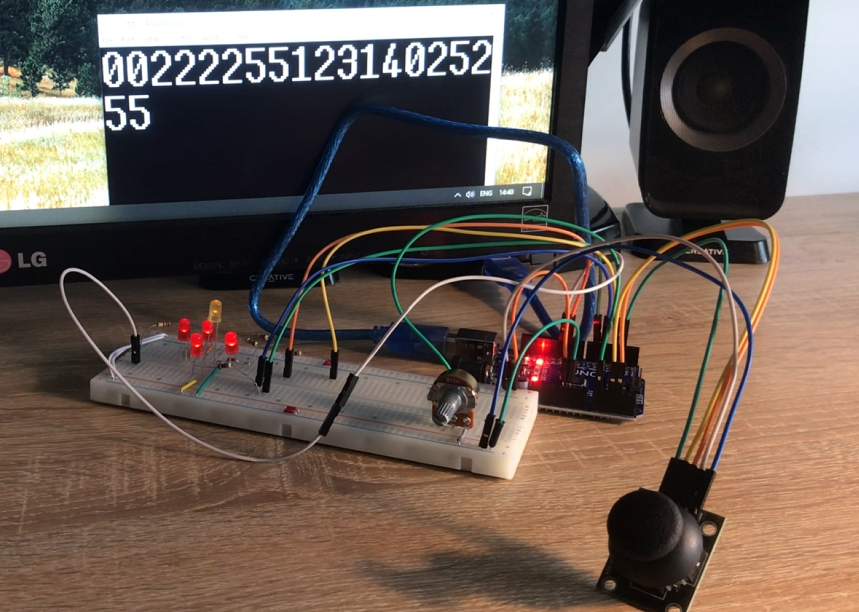

# AVR-Based LED Control with Joystick and Potentiometer

## Project Overview
This project utilizes the AVR ATmega328P microcontroller on an Arduino Uno board to control LEDs using the HW-504 joystick and adjust their brightness via a potentiometer. The potentiometer signal is also transmitted via UART communication to a computer, where the values (ranging from 0 to 255) are displayed in the Tera Term application.

### Features:
- LED control using a joystick (HW-504)
- Brightness adjustment via a potentiometer
- UART communication to send potentiometer values to a PC
- Utilization of PWM, ADC, and UART modules

## Required Components
- **Arduino Uno** (ATmega328P microcontroller)
- **HW-504 joystick module**
- **Potentiometer**
- **LEDs** (multiple)
- **Resistors** (appropriate values for LEDs)
- **Connecting wires**
- **Breadboard**
- **USB cable for Arduino programming**
- **Computer with Tera Term or another serial monitor**

## Project Photo

## Code
The project uses C programming for AVR, and the main functionalities include:
- Reading joystick values using ADC
- Controlling LED brightness using PWM
- Sending potentiometer values over UART

### Key Code Snippets:
- **ADC Read Functions** (10-bit and 8-bit)
- **UART Initialization and Communication**
- **PWM Configuration for LED Brightness Control**

## Installation & Usage
1. Connect the components according to the circuit diagram.
2. Upload the provided code to the Arduino Uno using the Arduino IDE.
3. Open Tera Term (or another serial monitor) and set the baud rate to **9600**.
4. Adjust the joystick and potentiometer to control the LEDs and monitor the potentiometer values on the PC.

## Future Improvements
- Adding more LED patterns or effects
- Implementing a graphical interface to display values in real-time
- Enhancing joystick control for more complex applications

## License
This project is open-source and free to use for educational purposes.

